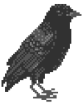

[](https://github.com/gauravmandall/gauravmandall/actions)
[](https://github.com/gauravmandall/gauravmandall/actions)


<!--  -->


<!-- <pre>
      ___           ___           ___       ___       ___
     /\__\         /\  \         /\__\     /\__\     /\  \
    /:/  /        /::\  \       /:/  /    /:/  /    /::\  \
   /:/__/        /:/\:\  \     /:/  /    /:/  /    /:/\:\  \
  /::\  \ ___   /::\~\:\  \   /:/  /    /:/  /    /:/  \:\  \
 /:/\:\  /\__\ /:/\:\ \:\__\ /:/__/    /:/__/    /:/__/ \:\__\
 \/__\:\/:/  / \:\~\:\ \/__/ \:\  \    \:\  \    \:\  \ /:/  /
      \::/  /   \:\ \:\__\    \:\  \    \:\  \    \:\  /:/  /
      /:/  /     \:\ \/__/     \:\  \    \:\  \    \:\/:/  /
     /:/  /       \:\__\        \:\__\    \:\__\    \::/  /
     \/__/         \/__/         \/__/     \/__/     \/__/
</pre> -->


<!-- <p align="center">

</p> -->


<!-- <p align="center">
  
</p> -->




<br>

I'm **Gaurav**, a Rust enthusiast with a passion for open source and solid skills in TypeScript. I'm currently a beginner in Rust.

[](https://github.com/gauravmandall.gpg) [](https://github.com/gauravmandall)


<br>


Ever since I joined GitHub **4** years ago, I pushed **2540** commits, opened **19** issues, submitted **51** pull requests, received **20** stars across **77** personal projects, and contributed to **8** public repositories.

<!--
  WARNING 🔔🚨🚨🚨🚨🚨🚨🚨🔔
  Please think twice before BLINDLY COPYING my profile readme.
  Design your own that suit your needs and personality! Or well,
  at least remember to change the name, project, shell,
  etc!
-->

<!-- <h1 align="center">, I'm <b>Gaurav!<b/> </h1> -->


Here is a list of my **personal projects**:

| **Rust**                                                                                                                                                                                                                                                                                                                                                                                                                                                                                                                                                                                                                                                                                                                                                                                                                                                                                                                                                                                                                                                                                                                                                                                                                                                                                                                                    | **Bash**, **Typescript**, **Go**, **Python**, **Kotlin**, **Java**, **JS**                                                                                                                                                                                                                                                                                                                                                                                                                                                                                                                                                                                                                                                                                                                                                                                                                                                                                                                                                                                                                                                                                                                                                                                                                                                                                                        |
| --------------------------------------------------------------------------------------------------------------------------------------------------------------------------------------------------------------------------------------------------------------------------------------------------------------------------------------------------------------------------------------------------------------------------------------------------------------------------------------------------------------------------------------------------------------------------------------------------------------------------------------------------------------------------------------------------------------------------------------------------------------------------------------------------------------------------------------------------------------------------------------------------------------------------------------------------------------------------------------------------------------------------------------------------------------------------------------------------------------------------------------------------------------------------------------------------------------------------------------------------------------------------------------------------------------------------------------------------------- | --------------------------------------------------------------------------------------------------------------------------------------------------------------------------------------------------------------------------------------------------------------------------------------------------------------------------------------------------------------------------------------------------------------------------------------------------------------------------------------------------------------------------------------------------------------------------------------------------------------------------------------------------------------------------------------------------------------------------------------------------------------------------------------------------------------------------------------------------------------------------------------------------------------------------------------------------------------------------------------------------------------------------------------------------------------------------------------------------------------------------------------------------------------------------------------------------------------------------------------------------------------------------------------------------------------------------------------------------------------------------------- |
| • [flx](https://github.com/gauravmandall/flx) - A highly secure file sharing app (upcoming)<br>• [shelly](https://github.com/gauravmandall/shelly) - A TUI for tracking cryptocurrencies like a boss (upcoming)<br>• [vsnode](https://github.com/gauravmandall/vsnode) - Fast and intuitive text editor (upcoming)<br>• [gpgtui](https://github.com/gauravmandall/gpgtui) - Terminal user interface for GnuPG (upcoming)<br>• [solcon](https://github.com/gauravmandall/solcon) - A minimal blockchain dex (upcoming) | • [gorlabs](https://github.com/gorlabscom/gorlabs) - A microsaas platform to ship fast.<br>• [vid-paywall](https://github.com/gauravmandall/vid-paywall) - Video paywall system to prevent piracy.<br>• [saasmd](https://www.npmjs.com/package/saasmd) - A TUI for kickstart the NextJs projects.<br>• [nimble-search](github.com/gauravmandall/nimble-search) - An AI search engine inspired by perplexity (upcoming)<br>• [geohot](https://github.com/gauravmandall/geohot) - A web3 wallet generator using bip39 and Mnemonics.<br>• [cctvAi](https://github.com/gauravmandall/cctvAi) - AI camera app to detect humans and record them.<br>• [fullstack-auth](https://github.com/gauravmandall/fullstack-auth) - An extended authentication project for auth.js<br> |


<br/>


**:zap: Recent Activity:**

<!--START_SECTION:activity-->
1. 🗣 Commented on [#1](https://github.com/Gorlabscom/gorlabs/issues/1#issuecomment-2206173876) in [Gorlabscom/gorlabs](https://github.com/Gorlabscom/gorlabs)
2. 🔒 Closed issue [#1](https://github.com/Gorlabscom/gorlabs/issues/1) in [Gorlabscom/gorlabs](https://github.com/Gorlabscom/gorlabs)
3. 🗣 Commented on [#2](https://github.com/Gorlabscom/gorlabs/pull/2#issuecomment-2206164876) in [Gorlabscom/gorlabs](https://github.com/Gorlabscom/gorlabs)
4. 🎉 Merged PR [#2](https://github.com/Gorlabscom/gorlabs/pull/2) in [Gorlabscom/gorlabs](https://github.com/Gorlabscom/gorlabs)
5. 🗣 Commented on [#1](https://github.com/Gorlabscom/gorlabs/issues/1#issuecomment-2205262416) in [Gorlabscom/gorlabs](https://github.com/Gorlabscom/gorlabs)
<!--END_SECTION:activity-->

<!--START_SECTION:waka-->


**🐱 My GitHub Data** 

> 📦 1.3 MB Used in GitHub's Storage 
 > 
> 🏆 132 Contributions in the Year 2025
 > 
> 💼 Opted to Hire
 > 
> 📜 172 Public Repositories 
 > 
> 🔑 36 Private Repositories 
 > 
**I'm a Night 🦉** 

```text
🌞 Morning                98 commits          █░░░░░░░░░░░░░░░░░░░░░░░░   03.85 % 
🌆 Daytime                403 commits         ████░░░░░░░░░░░░░░░░░░░░░   15.85 % 
🌃 Evening                349 commits         ███░░░░░░░░░░░░░░░░░░░░░░   13.72 % 
🌙 Night                  1693 commits        █████████████████░░░░░░░░   66.57 % 
```


📊 **This Week I Spent My Time On** 

```text
🕑︎ Time Zone: Asia/Kolkata

💬 Programming Languages: 
No Activity Tracked This Week

🐱‍💻 Projects: 
No Activity Tracked This Week

💻 Operating System: 
No Activity Tracked This Week
```


 Last Updated on 26/01/2025 12:17:28 UTC
<!--END_SECTION:waka-->

<!--START_SECTION:waka-simple-->
<!--END_SECTION:waka-simple-->

<b>Note:</b> Top languages is only a metric of the languages my public code consists of and doesn't reflect experience or skill level.


For all my latest updates, follow me on [X](https://x.com/gauravmandall). If you have **job-related** inquiries, please don't hesitate to connect with me on [LinkedIn](https://www.linkedin.com/in/gauravmandall/).

If you want to support my work, consider [sponsoring me](https://github.com/sponsors/gauravmandall)! 💖

**~** [_gauravmandall.vercel.app_](https://gauravmandall.vercel.app/)


[](https://github.com/gauravmandall/github-github-readme-activity-graph)

<p align="center">
  
</p>

Liked it ?

*ERC-20 / EVM: **0x229039E9dE6c76b8634D00A3C2A4e10Ec8e60341***

*BTC: **bc1qsuxuyedeuct2u6cdrvpacwrhkfseysrex8alrn***

<div align="center">
<h3 align="center">Show some &nbsp;❤️&nbsp; by starring some of the repositories!</h3>
</div>

<p align="center">
  
</p>
